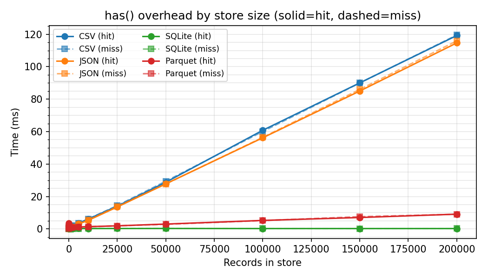
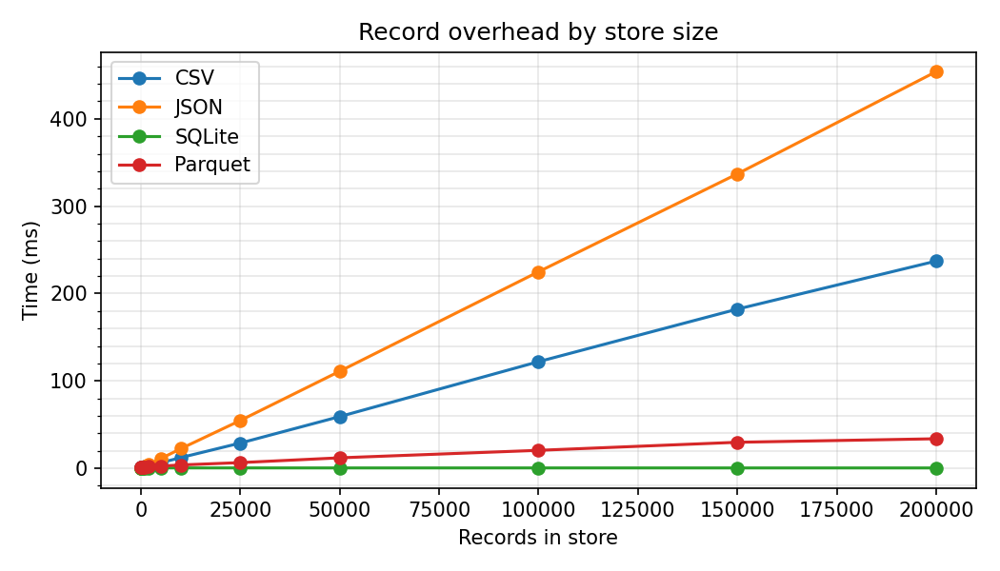

# Performance

The dominant cost in `once` is store I/O — reading the store to check whether a key exists, and writing to it when recording a new run.

## What was measured

The benchmark calls `backend.has()` and `backend.record()` directly — it does not go through the decorator. It isolates the store I/O cost specifically, and does not include the decorator's own work (argument binding, key extraction, file lock acquisition).

For each backend and a range of store sizes, we measured:

- **Skip check** (`has()`) — the time to look up a key that is present in the store.
- **Record** (`record()`) — the time to write a new entry to the store.

Each measurement is the mean of 20 repetitions. Store entries each had two key columns (`x`, `y`).

### Environment

| | |
|---|---|
| Machine | Apple M2, 16 GB RAM |
| OS | macOS (darwin arm64) |
| Python | 3.14.0 |
| pandas | 3.0.1 |
| pyarrow | 23.0.1 |
| filelock | 3.25.1 |
| Store sizes tested | 0, 10, 100, 500, 1000, 2000, 5000, 10000 records |

Results on different hardware will vary, but the relative shape — SQLite staying flat, file-based backends growing linearly — holds regardless of machine.

## Results

### Skip check overhead



### Record overhead



## What the numbers mean

**SQLite is the only backend that stays flat.** Its skip check and record time are essentially constant (~0.3–0.6 ms) regardless of how many records are in the store. This is because SQLite uses a B-tree index for lookups and writes are transactional.

**CSV, JSON, and Parquet all read the entire file on every operation.** Their overhead grows with store size because checking whether a key exists requires loading all existing records first. At 10,000 records, CSV and JSON skip checks take ~6 ms each; JSON record writes reach ~23 ms because the whole file is rewritten on every call.

**Parquet has a higher fixed cost than CSV or JSON at small sizes** (~1 ms at 10 records vs ~0.6 ms) due to the cost of parsing the binary format, but it scales more gently than JSON at larger sizes (~3.8 ms record writes at 10,000 records vs ~23 ms for JSON).

## Practical guidance

For most experiment sweeps the overhead is negligible — a skip check under 1 ms is undetectable against any function that does real work. But it becomes relevant in two situations:

- **Very fast functions** (sub-millisecond): the overhead can dominate. Consider batching or restructuring so that `once` wraps a coarser unit of work.
- **Very large stores with file-based backends**: at 5,000+ records, CSV and JSON become noticeably slow. Switch to SQLite if your store will grow large, especially in combination with parallel workers (see [Use with Multiprocessing](../how-to/use-with-multiprocessing.md)).

## Reproducing these results

The benchmarking script lives at `benchmarks/run_benchmarks.py`:

```
$ uv run python benchmarks/run_benchmarks.py
```

It re-generates the plots in `docs/img/`.
